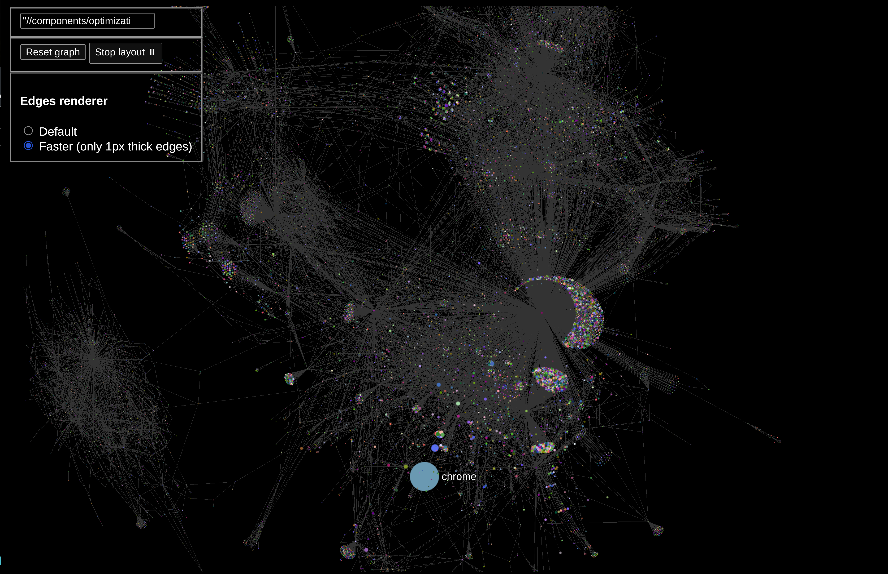

### [Parent README](https://github.com/jacomyal/sigma.js/blob/main/README.md)

## Graph renderer (Sigma.js meta example)
(e. g. for visualizing dependencies)



```bash
npm i \
&& cd examples/chrome_deps \
&& npm i \
&& npm start 
```
then
```bash
firefox localhost:3000
```