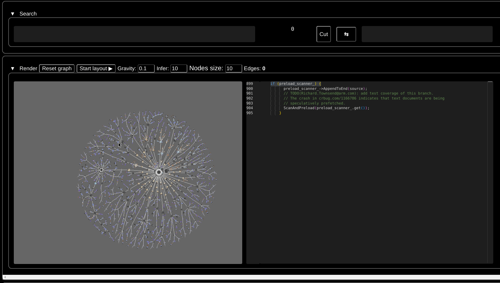

### [Parent README](https://github.com/jacomyal/sigma.js/blob/main/README.md)

***
___
---

## :books: Graph renderer (Sigma.js meta example)
This project is aimed to serve as an intermediate layer between your project and useful graph representation. Right now it ships as a full-stack application with TypeScript frontend and Flask backend and only serves as a representation.

---
---

### :construction: Under development!
Not even alpha. Supports only chromium for the moment!

---
---

### :pushpin: Initial roadmap:
1. Implement golden layout like there https://godbolt.org/
2. Add layers with filter masks
3. Move construction of diff to the server microservice

---
---

### :sparkles: Features:
#### :art: Feature 1: Rendering of clang AST and valgrind with UI


---


---

#### :bar_chart: Feature 2: Getting histogram of tokens in file by count


---

#### :arrow_double_down: Feature 3: Getting all paths from one point to another


---

#### :mag_right: Feature 4: Searching and filtering by nodes' attributes

  a) Let's say we want to delete functions from callgrind that appear to have no name:

  

---

  b) Now let's delete leafs

  

---

#### :balance_scale: Feature 5: Getting diff of revisions with locations for every node in each file


---


#### :notebook: Feature 6: Searching AST by code



---
---

### :gear: Setup
```bash
npm i \
&& cd examples/chrome_deps \
&& npm i
```
then probably
```bash
chmod +x replace-server-address.sh \
&& ./replace-server-address.sh localhost your_server_address.com
```
then
```bash
npm start
```
You're all set!
```bash
firefox localhost:3000
```

